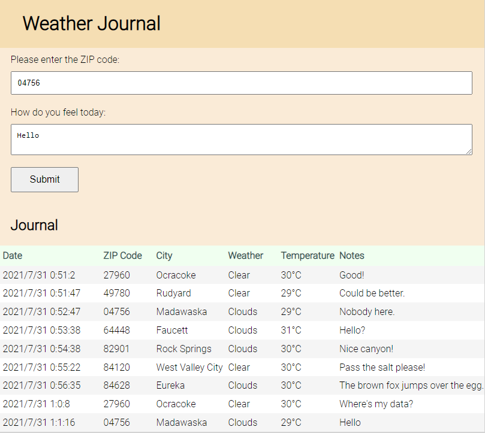

# Project Weather Journal App
*Udacity Front End Web Developer Nanodegree Program*

A simple app to get the weather temperature at a given US zip code. The user can enter the US zip 
code in a web form. In addition, the user can submit a free text as personal notes. Submitted 
data is stored at the server side.


*Sample screen shot*

For a map of US ZIP code check https://www.unitedstateszipcodes.org.

The project demonstrates development of server side and client side code. Use of open APIs to 
retrieve open data (https://openweathermap.org/). Use of asynchronous Java functions and 
dynamically updating HTML elements in the web user interface with data retrieved from the server.

To run the project install the following Node packages:

```
npm install cors
npm install body-parser
npm install express
```

Run the server code with:

`node server.js`

In your web browser navigate to http://localhost:3000/.

## Appendix

### Common commands

For Node.js installation see https://nodejs.org/en/download/.

Check the version of Node.js:

`node -v`
